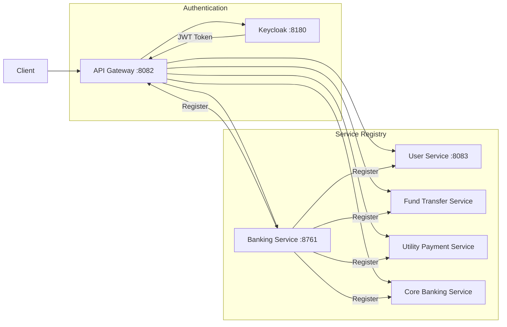
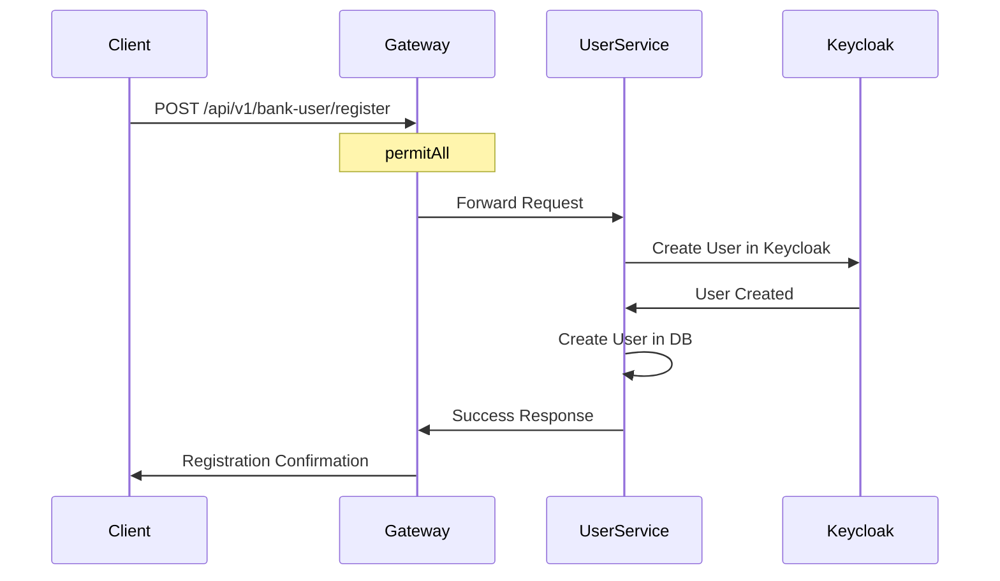
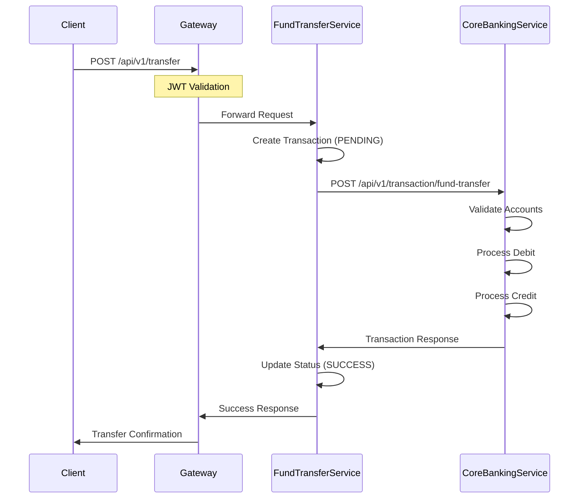
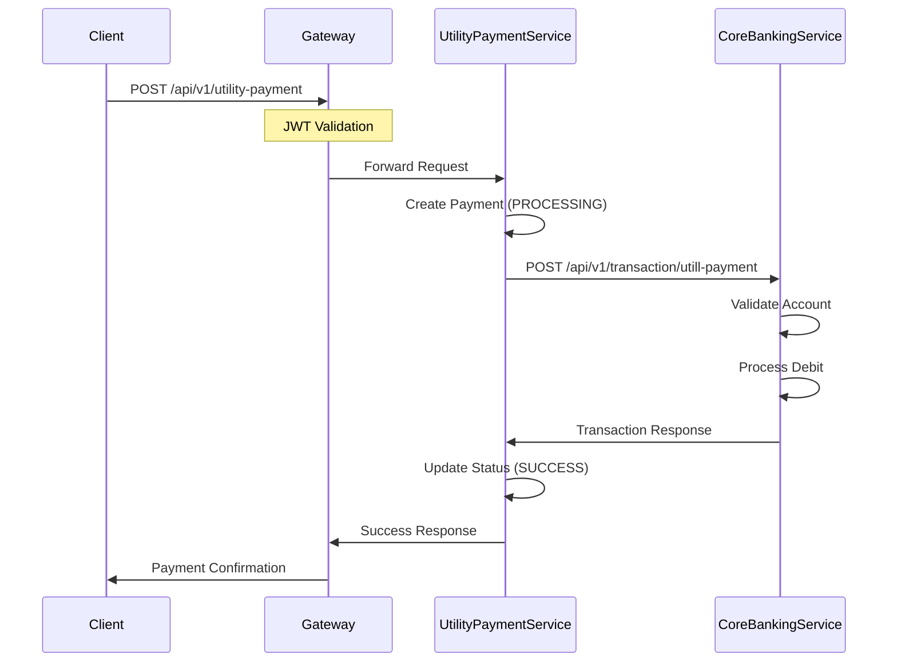
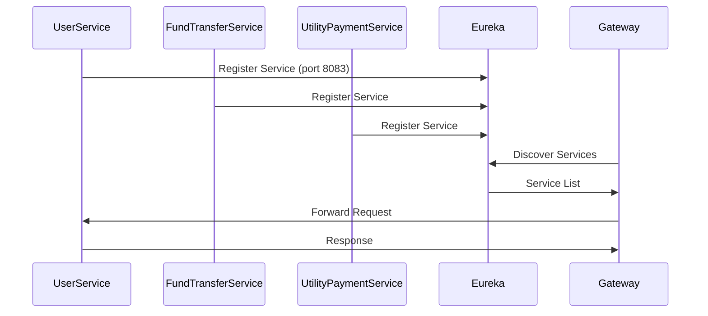

# Distributed Internet Banking System

## System Architecture

## Sequence Diagrams

### 1. User Registration Flow

### 2. Fund Transfer Flow

### 3. Utility Payment Flow

### 4. Service Discovery Flow

## Components

1. **API Gateway** (port 8082)
   - Spring Cloud Gateway
   - JWT Validation
   - Service Routing
   - Public/Protected Endpoints

2. **User Service** (port 8083)
   - User Management
   - Keycloak Integration
   - Database Operations
   - REST Endpoints

3. **Fund Transfer Service**
   - Transaction Management
   - Account Operations
   - Core Banking Integration
   - Transaction Status Tracking
   - Endpoint: `/api/v1/transfer`

4. **Utility Payment Service**
   - Payment Processing
   - Provider Management
   - Account Operations
   - Payment Status Tracking
   - Endpoint: `/api/v1/utility-payment`

5. **Core Banking Service**
   - Account Management
   - Transaction Processing
   - Balance Operations
   - Account Validation
   - Endpoints: 
     - `/api/v1/transaction/fund-transfer`
     - `/api/v1/transaction/utill-payment`

6. **Banking Service** (port 8761)
   - Eureka Server
   - Service Registry
   - Service Discovery

7. **Keycloak** (port 8180)
   - Authentication Server
   - User Management
   - JWT Token Issuance
