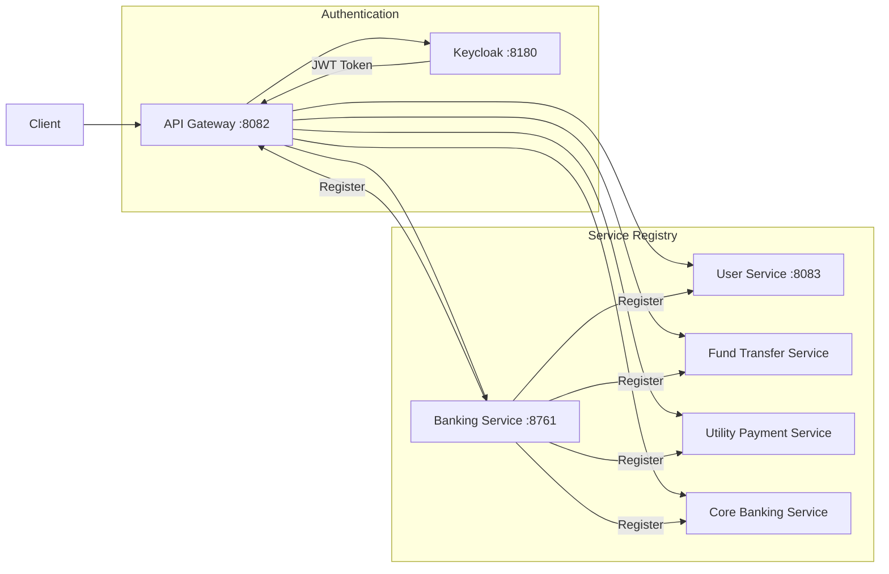
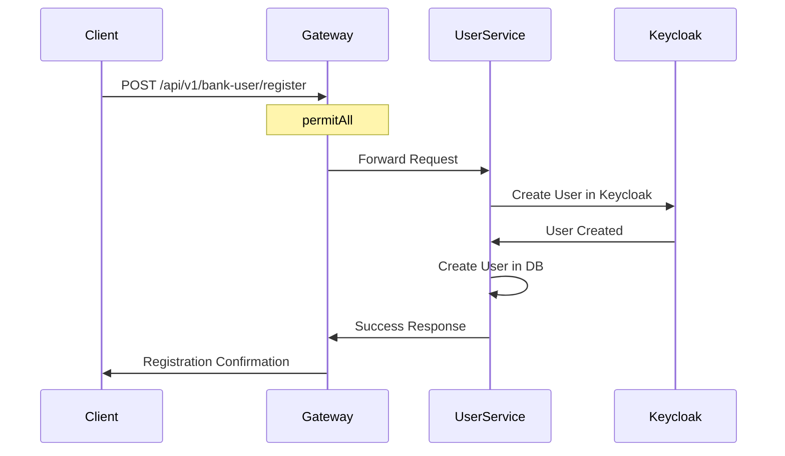
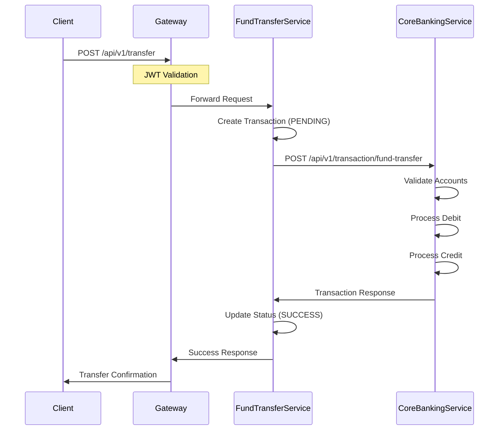
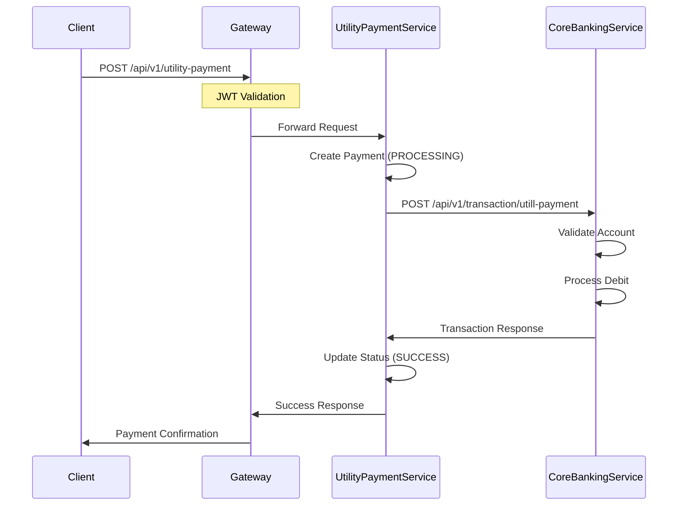
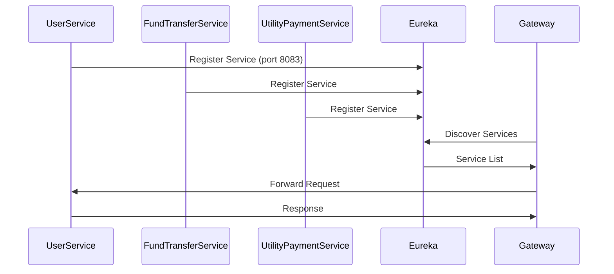
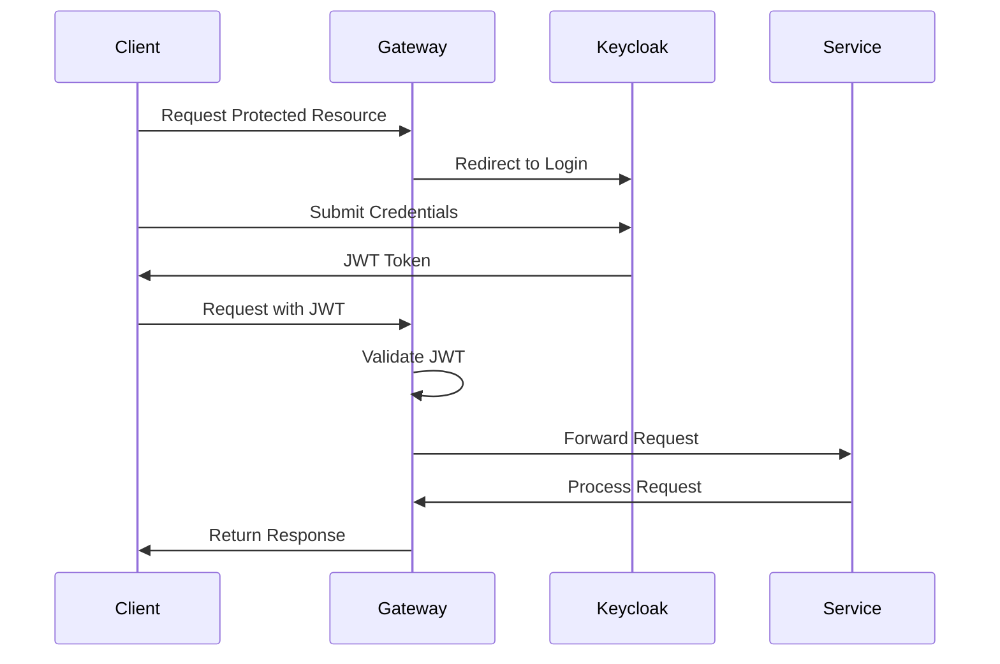
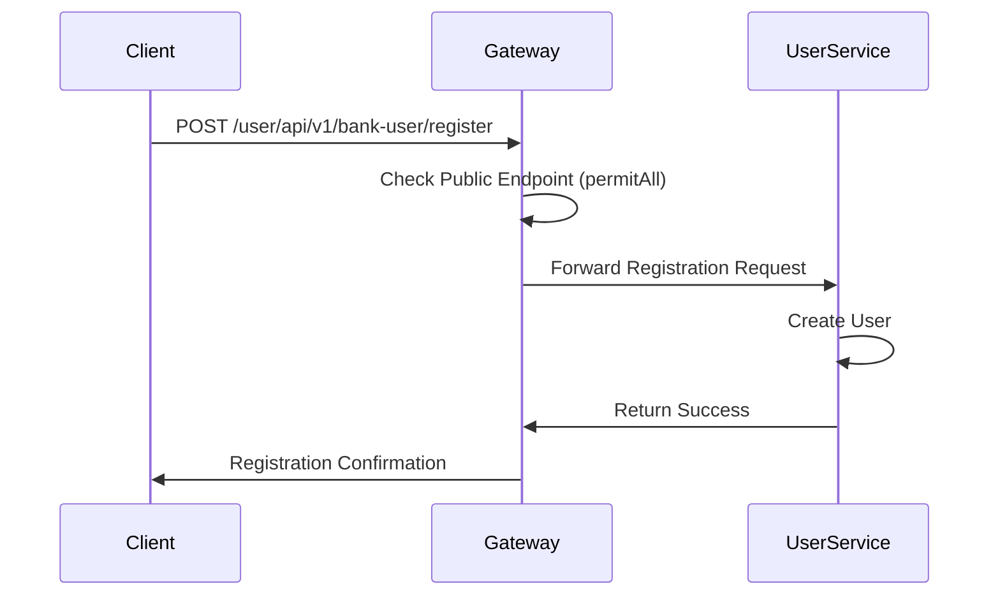
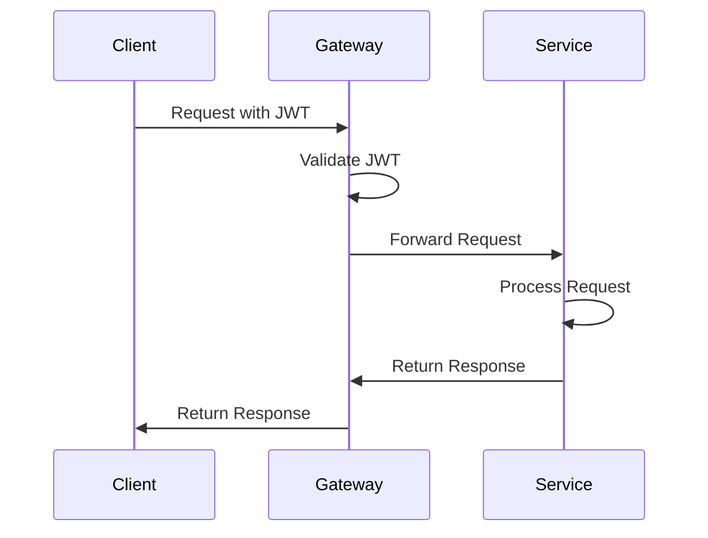
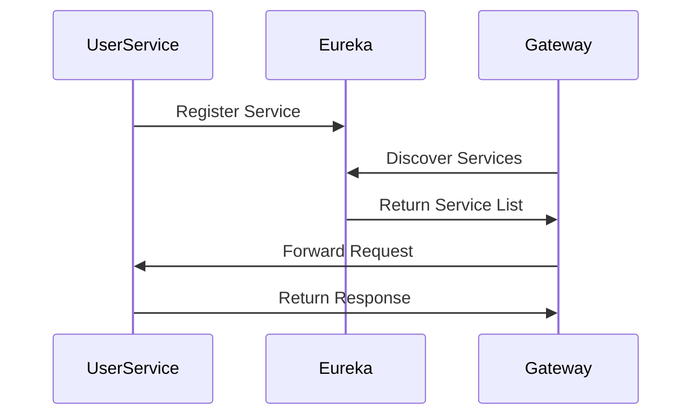
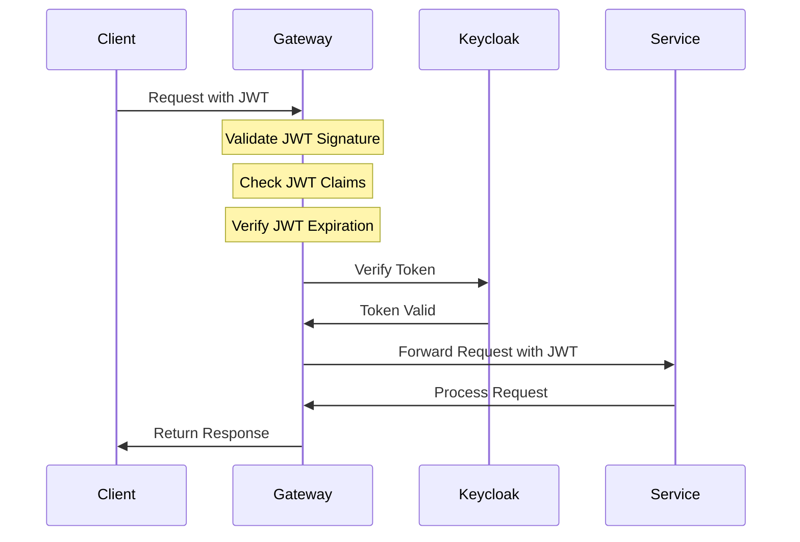

# Distributed Internet Banking System

## System Architecture



## Sequence Diagrams

### 1. User Registration Flow


### 2. Fund Transfer Flow


### 3. Utility Payment Flow


### 4. Service Discovery Flow


## Components

1. **API Gateway** (port 8082)
   - Spring Cloud Gateway
   - JWT Validation
   - Service Routing
   - Public/Protected Endpoints

2. **User Service** (port 8083)
   - User Management
   - Keycloak Integration
   - Database Operations
   - REST Endpoints

3. **Fund Transfer Service**
   - Transaction Management
   - Account Operations
   - Core Banking Integration
   - Transaction Status Tracking
   - Endpoint: `/api/v1/transfer`

4. **Utility Payment Service**
   - Payment Processing
   - Provider Management
   - Account Operations
   - Payment Status Tracking
   - Endpoint: `/api/v1/utility-payment`

5. **Core Banking Service**
   - Account Management
   - Transaction Processing
   - Balance Operations
   - Account Validation
   - Endpoints: 
     - `/api/v1/transaction/fund-transfer`
     - `/api/v1/transaction/utill-payment`

6. **Banking Service** (port 8761)
   - Eureka Server
   - Service Registry
   - Service Discovery

7. **Keycloak** (port 8180)
   - Authentication Server
   - User Management
   - JWT Token Issuance

## 🚀 Features

- **Microservices Architecture**
  - API Gateway for centralized routing
  - Service discovery with Eureka
  - Distributed user management
  - Secure banking operations

- **Security**
  - JWT-based authentication
  - Keycloak integration
  - Role-based access control
  - Secure service-to-service communication

- **Scalability**
  - Service discovery and registration
  - Load balancing
  - Circuit breaker pattern
  - Distributed tracing

## 🏗️ Architecture

### System Components

- **API Gateway** (port 8082)
  - Central entry point
  - Request routing
  - Authentication/Authorization
  - Token relay

- **Keycloak** (port 8180)
  - Authentication server
  - JWT token issuance
  - User management
  - Role management

- **Banking Service** (port 8761)
  - Eureka Server
  - Service registry
  - Service discovery

- **User Service** (port 8083)
  - User management
  - Registration
  - Profile management

## 📦 Prerequisites

- Java 21
- Gradle
- Keycloak Server
- Docker (optional)

## 🛠️ Installation

1. Clone the repository:
```bash
git clone https://github.com/yourusername/distributed-internet-banking.git
cd distributed-internet-banking
```

2. Start Keycloak:
```bash
docker run -p 8180:8080 -e KEYCLOAK_ADMIN=admin -e KEYCLOAK_ADMIN_PASSWORD=admin quay.io/keycloak/keycloak:latest start-dev
```

3. Configure Keycloak:
   - Create realm: `distributed-internet-banking`
   - Create client: `banking-core-client`
   - Configure client settings
   - Create roles and users

4. Start the services in order:
```bash
# Start Banking Service (Eureka Server)
cd Banking-service
./gradlew bootRun

# Start User Service
cd Banking-user-service
./gradlew bootRun

# Start API Gateway
cd Banking-api-getway
./gradlew bootRun
```

## 🔐 Security Configuration

### OAuth 2.0 with Keycloak
- **Authentication Flow**: OAuth 2.0 Authorization Code Flow
- **Token Type**: JWT (JSON Web Tokens)
- **Client Credentials**: 
  - Client ID: `banking-core-client`
  - Client Secret: Configured in Keycloak
  - Grant Type: `client_credentials`

### Keycloak Setup
- Realm: `distributed-internet-banking`
- Client: `banking-core-client`
- Token Type: JWT
- Port: 8180
- Server URL: Configured in application properties

### API Gateway Security
- JWT validation
- Token relay
- Path-based security
- Public registration endpoint
- OAuth2 Resource Server configuration
- OAuth2 Client configuration

### User Service Security
- Keycloak Admin Client integration
- User management through Keycloak
- Credential management
- Role-based access control

### Security Features
- OAuth 2.0 Authorization Code Flow
- JWT-based authentication
- Token validation at Gateway
- Role-based access control
- Secure service communication
- Public/Protected endpoints
- Client credentials grant type
- Token relay to backend services

## 📡 API Endpoints

### Public Endpoints
- `POST /user/api/v1/bank-user/register` - User registration

### Protected Endpoints
- `GET /banking-core/**` - Banking operations
- `GET /user/**` - User operations

## 🔄 Data Flow

### Sequence Diagrams

## 1. Authentication Flow


## 2. Registration Flow


## 3. Protected API Request Flow


## 4. Service Discovery Flow


## 5. Token Validation Flow


## 🛡️ Security Features

- JWT-based authentication
- Token validation at Gateway
- Role-based access control
- Secure service communication
- Public/Protected endpoints

## 📊 Monitoring

- Service health checks
- Request logging
- Authentication logs
- Performance metrics
- Error tracking

## 🤝 Contributing

1. Fork the repository
2. Create your feature branch (`git checkout -b feature/AmazingFeature`)
3. Commit your changes (`git commit -m 'Add some AmazingFeature'`)
4. Push to the branch (`git push origin feature/AmazingFeature`)
5. Open a Pull Request

## 📝 License

This project is licensed under the MIT License - see the [LICENSE](LICENSE) file for details.

## 👥 Authors

- Your Name - [@yourusername](https://github.com/yourusername)

## 🙏 Acknowledgments

- Spring Cloud
- Spring Security
- Keycloak
- Eureka
- All contributors and maintainers 